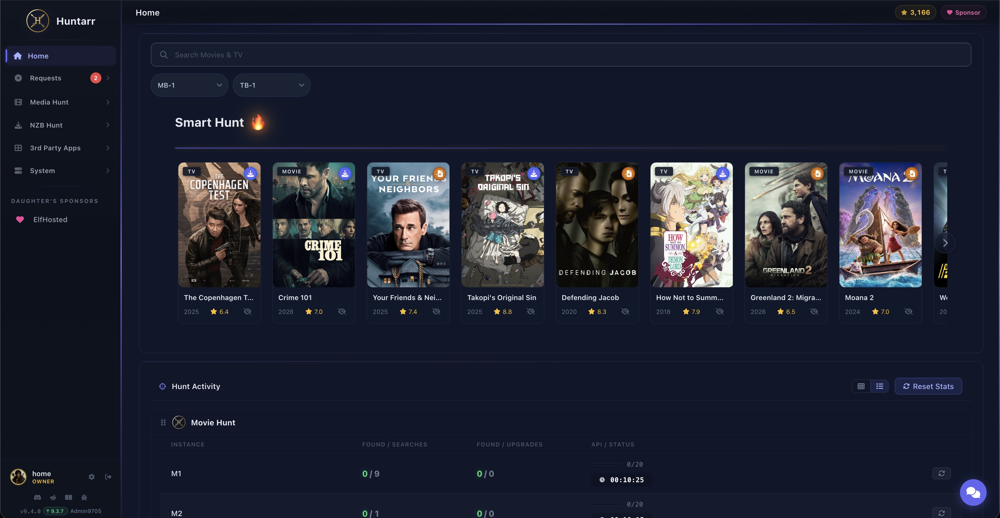
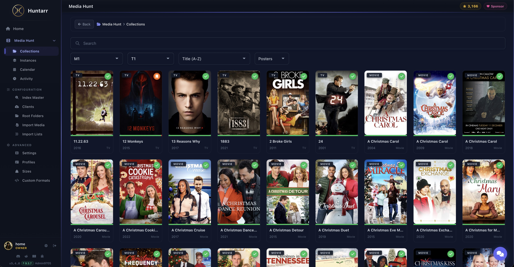
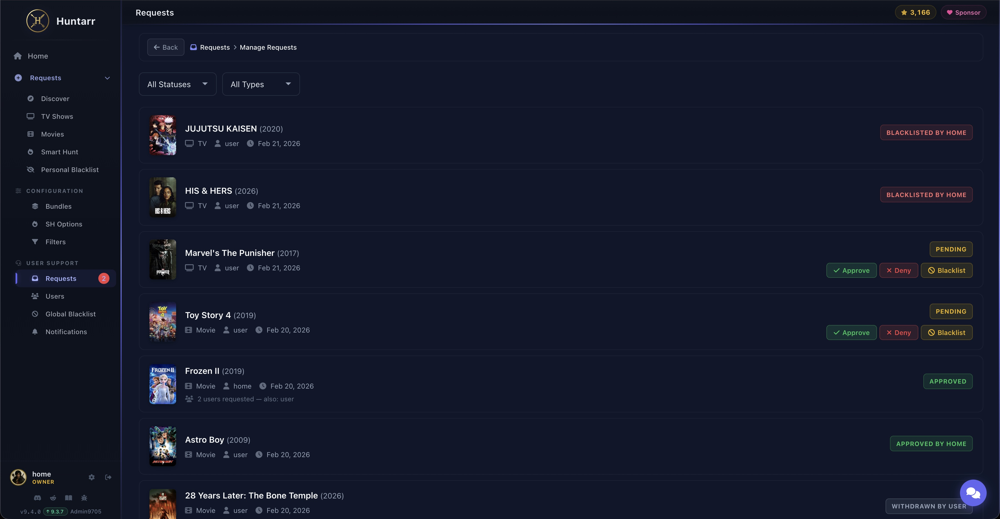
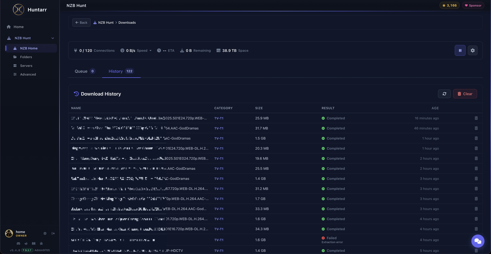
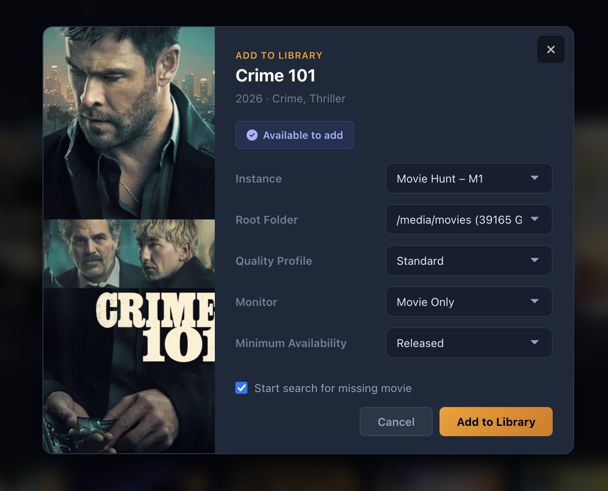
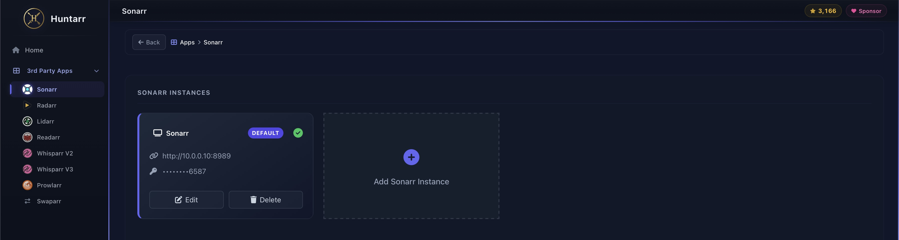
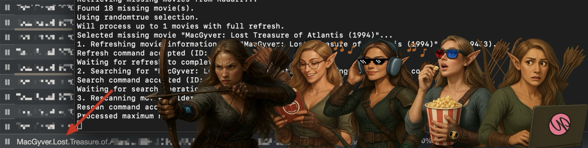

<h1 align="center">Huntarr</h1>

<p align="center">
  
</p>

<p align="center">
  Automated media hunting for Sonarr, Radarr, Lidarr, Readarr, and Whisparr. Finds missing content and upgrades quality — continuously and quietly in the background.
</p>

<p align="center">
  <a href="https://hub.docker.com/r/huntarr/huntarr"></a>
  <a href="https://github.com/plexguide/Huntarr.io/blob/main/LICENSE"></a>
  <a href="https://discord.com/invite/PGJJjR5Cww"></a>
</p>

<h2 align="center">Want to Help? Click the Star in the Upper-Right Corner! ⭐</h2>

## PayPal Donations — Building My Daughter's Future

My 12-year-old daughter loves singing, dancing, and exploring STEM. She's an A-B honor roll student with big dreams for the future. Any donation you make will go directly toward her college fund, helping her turn those dreams into reality. Thank you for your support!

[](https://www.paypal.com/donate?hosted_button_id=58AYJ68VVMGSC)

---

<p align="center">
  
</p>

---

## The Problem

Your *arr apps (Sonarr, Radarr, etc.) monitor RSS feeds for new releases, but they don't go back and search for missing episodes or movies already in your library. Over time, gaps build up — missing seasons, unavailable albums, content stuck below your quality cutoff.

## The Solution

Huntarr systematically scans your entire library, finds all missing content, and searches for it in small batches that won't overwhelm your indexers or get you banned. It also finds content below your quality cutoff and triggers upgrades. It's the difference between a "mostly complete" library and actually having everything you want.

## Supported Apps

| Sonarr | Radarr | Lidarr | Readarr | Whisparr v2 | Whisparr v3 |
|:------:|:------:|:------:|:-------:|:-----------:|:-----------:|
| ✅ | ✅ | ✅ | ✅ | ✅ | ✅ |

---

## Media Hunt

Browse, discover, and manage your media collection. Media Hunt gives you a visual interface to see what's in your library, what's missing, and what needs upgrading — all in one place.

<p align="center">
  
</p>

## Requestarr

Let users request movies and TV shows through a clean request interface. Requests flow through an approval queue so you stay in control of what gets added to your library.

<p align="center">
  
</p>

## NZB Hunt

A built-in Usenet download client. Connect your Usenet servers and download NZBs directly — no separate download client needed.

<p align="center">
  
</p>

## Add to Library

Quickly add new movies and TV shows to your *arr apps. Search by title, pick your quality profile, and send it straight to Sonarr or Radarr.

<p align="center">
  
</p>

## Third-Party App Connections

Connect Huntarr to your existing *arr stack. Configure multiple instances of Sonarr, Radarr, Lidarr, Readarr, Whisparr, Prowlarr, and Swaparr — all from the settings page.

<p align="center">
  
</p>

---

## How It Works

1. **Connect** — Point Huntarr at your Sonarr, Radarr, Lidarr, Readarr, or Whisparr instances
2. **Hunt Missing** — Scans your library for missing content and searches in small, indexer-friendly batches
3. **Hunt Upgrades** — Finds content below your quality cutoff and triggers upgrade searches
4. **API Management** — Hourly caps prevent indexer overload; pauses when download queues are full
5. **Repeat** — Waits for your configured interval, then runs again. Hands-off, continuous improvement

## Installation

### Docker (Recommended)

```bash
docker run -d \
  --name huntarr \
  --restart unless-stopped \
  -p 9705:9705 \
  -v /path/to/config:/config \
  -e TZ=America/New_York \
  huntarr/huntarr:latest
```

### Docker Compose

```yaml
services:
  huntarr:
    image: huntarr/huntarr:latest
    container_name: huntarr
    restart: unless-stopped
    ports:
      - "9705:9705"
    volumes:
      - /path/to/config:/config
    environment:
      - TZ=America/New_York
```

### More Installation Methods

- [Unraid Installation](https://plexguide.github.io/Huntarr.io/getting-started/installation.html#unraid-installation)
- [Windows Installation](https://plexguide.github.io/Huntarr.io/getting-started/installation.html#windows-installation)
- [macOS Installation](https://plexguide.github.io/Huntarr.io/getting-started/installation.html#macos-installation)
- [Linux Installation](https://plexguide.github.io/Huntarr.io/getting-started/installation.html#linux-installation)

Once running, open your browser to `http://<your-server-ip>:9705`.

For full documentation, visit the [Huntarr Wiki](https://plexguide.github.io/Huntarr.io/).

---

## The Classic

For those who remember where it all started.

<p align="center">
  
</p>

---

## Other Projects

- [PlexGuide](https://github.com/plexguide/PlexGuide.com) — Self-hosted server management platform with Docker app store, reverse proxies, and MergerFS
- [Unraid Intel ARC Deployment](https://github.com/plexguide/Unraid_Intel-ARC_Deployment) — Convert videos to AV1 format

## The Perfect Pair: Huntarr & Cleanuparr

**Huntarr** finds missing media and upgrades your existing content. **Cleanuparr** keeps your download queue clean, removes clutter, and blocks malicious files. Together they create a hands-off media automation stack.

Learn more about [Cleanuparr](https://github.com/cleanuparr/cleanuparr).

## Contributors

<a href="https://github.com/plexguide/Huntarr.io/graphs/contributors">
  
</a>

## Change Log

Visit the [Releases](https://github.com/plexguide/Huntarr.io/releases/) page.

## License

Licensed under the [GNU General Public License v3.0](https://github.com/plexguide/Huntarr.io/blob/main/LICENSE).
